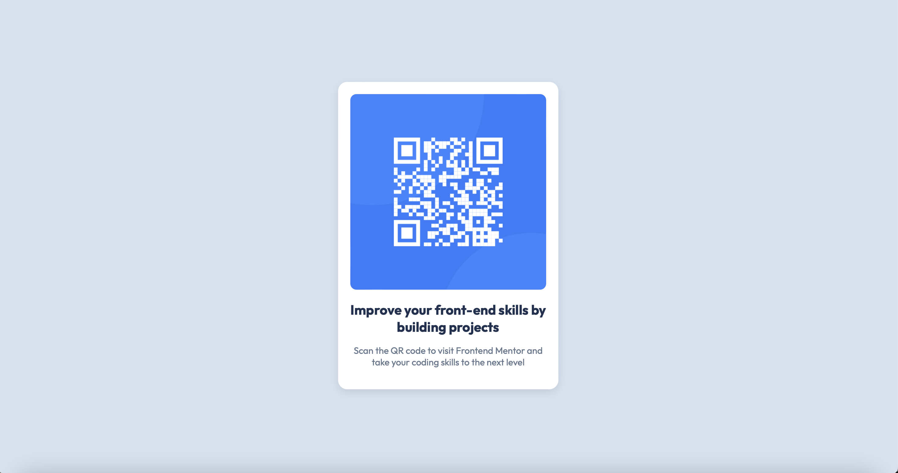

# Frontend Mentor - QR Code Component Solution

This is my solution to the [QR Code Component Challenge](https://www.frontendmentor.io/challenges/qr-code-component-iux_sIO_H) on Frontend Mentor.

## Screenshot

## Live Demo

- [Live Site URL](http://127.0.0.1:5500/index.html)
- [Solution on Frontend Mentor](https://www.frontendmentor.io/profile/KatarinaN98)

## Built With

- Semantic HTML5
- CSS (Flexbox)
- Mobile-first design approach

## What I Learned

This project helped me practice:
- Structuring a simple card component in HTML
- Styling with CSS and making it responsive
- Centering elements using Flexbox

## Continued Development

I would like to:
- Improve responsiveness further
- Add animations for a more interactive feel

## Useful Resources

- [CSS Tricks - Centering in CSS](https://css-tricks.com/centering-css-complete-guide/) - Helped me with centering techniques.

## Author

- GitHub - [@KatarinaN98](https://github.com/KatarinaN98)
- Frontend Mentor - [@KatarinaN98](https://www.frontendmentor.io/profile/KatarinaN98)
